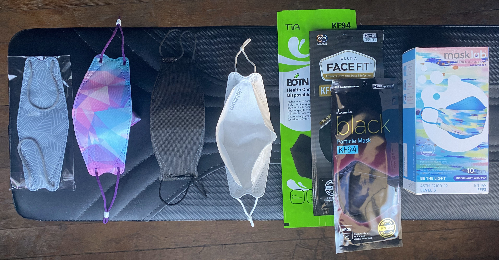
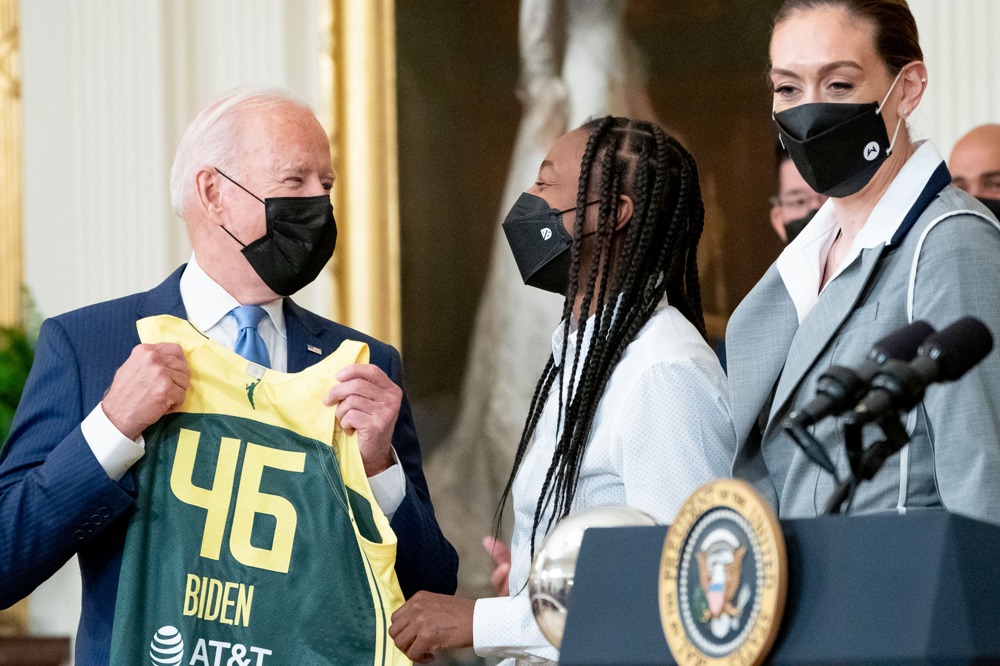
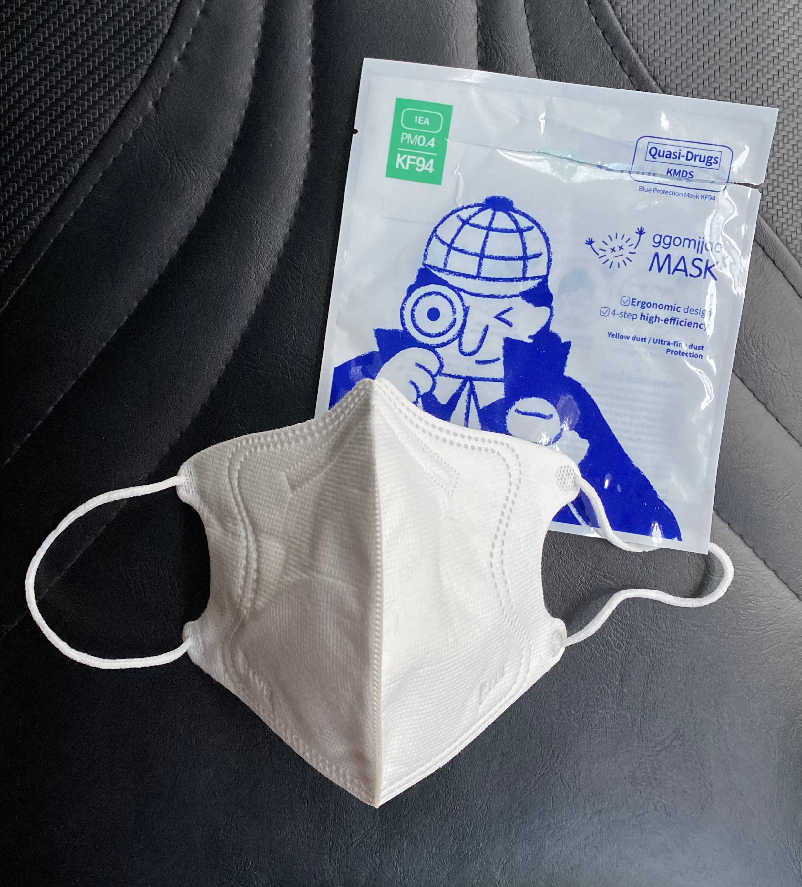
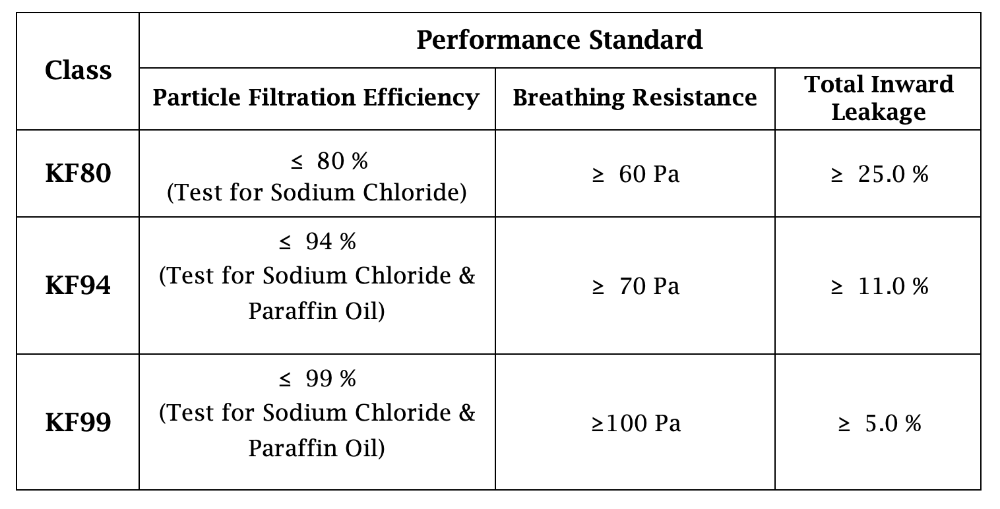

.jpg).](media/Hong_Joon-pyo,_Bae_Hyun-jin_in_Jamsil_Saemaeul_Market.jpg)

**KF94** is a South Korean general-public mask standard. Most KF94 masks feature a boat-style design and attach to the face using ear loops. The "KF" stands for "**K**orea **F**ilter." KF94 masks are certified to have at least a 94% particle filtration efficacy and a mean total inward leakage of less than 11% across test subjects.

KF94s are made in two form factors: the classic "boat style" (sometimes called "3D") design and a bifold (sometimes called "2D") design. All certified KF94 masks are made in South Korea.

KF94 masks are certified by the [South Korean Ministry of Food and Drug Safety](https://mfds.go.kr/eng/brd/m_65/view.do?seq=11&srchFr=&srchTo=&srchWord=&srchTp=&itm_seq_1=0&itm_seq_2=0&multi_itm_seq=0&company_cd=&company_nm=&page=1) in a manner similar to how the US-based NIOSH certifies N95 respirators. KF94 are [not exactly equivalent to US N95](https://multimedia.3m.com/mws/media/1793278O/3m-anz-2020-respiratory-protection-faq-healthcare.pdf); a different Korean standard, "1st class" (KMOEL-2017-64) is more like the NIOSH N95 standard. K94 is a *general-public* mask standard, not designed for industrial or occupational use like NIOSH N95. For instance, [there are KF94 masks available for children](https://www.youtube.com/watch?v=A88AGnN-nwI), but in the US there are no official NIOSH-certified N95s for children, as NIOSH is for *occupational* safety (the "O").

In addition to KF94, in [Korea there are also "KF80" masks](https://www.mfds.go.kr/eng/brd/m_75/view.do?seq=35&srchFr=&srchTo=&srchWord=&srchTp=&itm_seq_1=0&itm_seq_2=0&multi_itm_seq=0&company_cd=&company_nm=&page=1), which meet a less rigorous filtration standard.

The [3M Aura](/3M_Aura) is a N95 respirator with a boat-style design akin to the popular boat-style KF94.

## More on KF94 masks

-   [Video overview of FAQs on wearing K94](https://www.youtube.com/watch?v=_In-nBP6WkQ), including **how to get a good fit with a KF94**, how long you can wear one for & how to stop glasses from fogging up.
-   [Video overview of what KF94 masks are and how they differ from KN95 masks](https://www.youtube.com/watch?app=desktop&v=hf4fAujzLL0), from Be Healthy USA, a US distributor of KF94 masks.
-   ["Coronavirus FAQ: Why Am I Suddenly Hearing So Much About KF94 Masks?"](https://www.npr.org/sections/goatsandsoda/2021/01/22/959683338/coronavirus-faq-why-am-i-suddenly-hearing-so-much-about-kf94-masks) - NPR article on KF94 masks from Jan. 2020.
-   [About KF94](https://www.mfds.go.kr/eng/brd/m_75/view.do?seq=35&srchFr=&srchTo=&srchWord=&srchTp=&itm_seq_1=0&itm_seq_2=0&multi_itm_seq=0&company_cd=&company_nm=&page=1), on the South Korean Ministry of Food and Drug Safety website.
-   [Video demonstrating the South Korean KF94 distribution and rationing system](https://www.youtube.com/watch?app=desktop&v=katglAKrROI) during the early COVID pandemic (March 2020).
-   [Guide to verifying authenticity of KF94 masks](https://overseas.mofa.go.kr/my-en/brd/m_21422/view.do?seq=110) from the South Korean Ministry of Food and Drug Safety.

<!-- -->

-   Aaron Collins (who has a background in [aerosol](/Aerosol) science) has [a number of videos featuring reviews](https://www.youtube.com/watch?v=WE5Uo3F2TdU) and independent aerosol penetration tests of KF94 respirators. See [Aaron Collin's YouTube channel](https://www.youtube.com/user/coll0412/videos).

## Technical details of K94 standard

The technical details of the KF94 standard can be found on the South Korean Ministry of Food and Drug Safety website (in Korean). An [English-language summary document prepared by the South Korean MFDS](https://www.mfds.go.kr/brd/m_578/down.do?brd_id=plc0159&seq=41851&data_tp=A&file_seq=1) is available.

K94 masks have a particle filtration efficiency of at least 94% using a sodium chloride and paraffin oil aerosol and a mean total inward leakage of less than 11% across a panel of test subjects. While the standard only calls for a particle filtration efficiency of 94%, [independent tests of many KF94 masks show they almost always have a higher PFE, often in the 98+% range](https://docs.google.com/spreadsheets/d/1M0mdNLpTWEGcluK6hh5LjjcFixwmOG853Ff45d3O-L0/edit).

<figure class="wide">
<figcaption>Details of the KF80, KF94 and KF99 performance standards <a href="https://www.mfds.go.kr/brd/m_578/down.do?brd_id=plc0159&amp;seq=41851&amp;data_tp=A&amp;file_seq=1">from the South Korean MFDS</a>.</figcaption>
</figure>

## Where to buy KF94

As all certified KF94 must be made in South Korea, KF94 must be imported into countries other than South Korea. In the United States, online Korean beauty stores and Korean grocery stores (such as H Mart) often carry KF94.

Aaron Collins maintains a list of reliable sources for online KF94 purchase in his YouTube videos - [see the video description here and elsewhere](https://www.youtube.com/watch?v=WE5Uo3F2TdU&t=637s). He also has a [list of sources for kids KF94 masks](https://www.youtube.com/watch?v=A88AGnN-nwI). Large online retailers such as Amazon stock KF94s but [due to commingled inventory](https://www.redpoints.com/blog/amazon-commingled-inventory-management/), counterfeit or inauthentic KF94s may be shipped.

## See also

-   **[List of respirators](/List_of_respirators)** for information on other kinds of respirators & masks.
