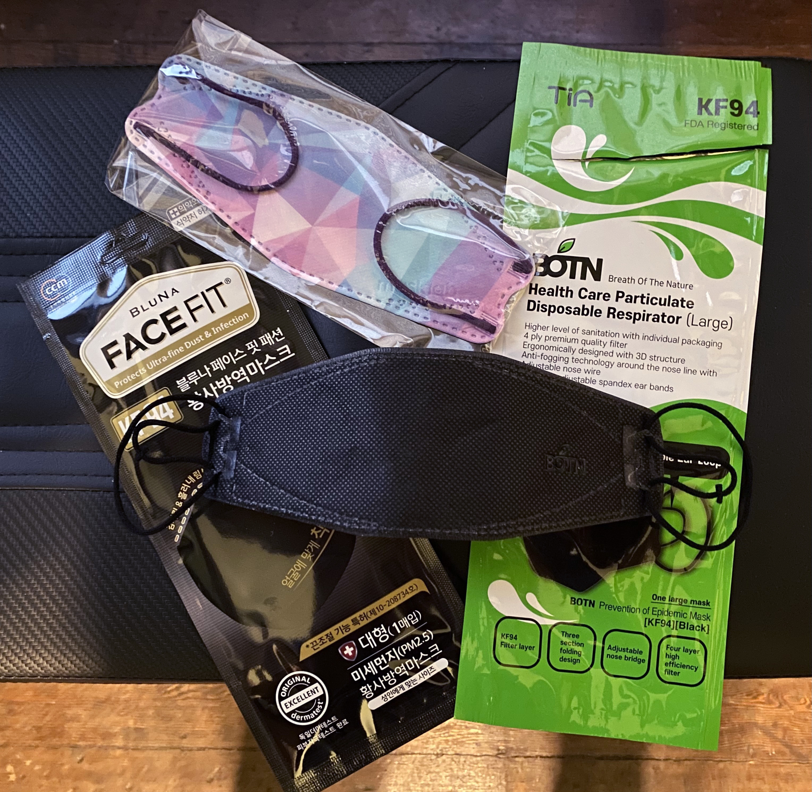

**KF94** is a South Korean general-public mask standard. Most KF94 masks feature a boat-style design and attach to the face using ear loops. The "KF" stands for "**K**orea **F**ilter."

KF94 masks are certified by the [South Korean Ministry of Food and Drug Safety](https://mfds.go.kr/eng/brd/m_65/view.do?seq=11&srchFr=&srchTo=&srchWord=&srchTp=&itm_seq_1=0&itm_seq_2=0&multi_itm_seq=0&company_cd=&company_nm=&page=1) in a manner similar to how the US-based NIOSH certifies N95 respirators. KF94 are [not considered equivalent to US N95](https://multimedia.3m.com/mws/media/1793278O/3m-anz-2020-respiratory-protection-faq-healthcare.pdf); a different Korean standard, "1st class" (KMOEL-2017-64) is more like the NIOSH N95 standard. K94 is a general-public mask standard, not designed for industrial or occupational use like NIOSH N95.

In addition to KF94, in [Korea there are also "KF80" masks](https://www.mfds.go.kr/eng/brd/m_75/view.do?seq=35&srchFr=&srchTo=&srchWord=&srchTp=&itm_seq_1=0&itm_seq_2=0&multi_itm_seq=0&company_cd=&company_nm=&page=1), which meet a less rigorous filtration standard.

## External links

-   [Video overview of FAQs on wearing K94](https://www.youtube.com/watch?v=_In-nBP6WkQ), including **how to get a good fit with a KF94**, how long you wear one & how to stop glasses from fogging up.
-   [Video overview of what KF94 masks are and how they differ from KN95 masks](https://www.youtube.com/watch?app=desktop&v=hf4fAujzLL0), from Be Healthy USA, a US distributor of KF94 masks.
-   ["Coronavirus FAQ: Why Am I Suddenly Hearing So Much About KF94 Masks?" ](https://www.npr.org/sections/goatsandsoda/2021/01/22/959683338/coronavirus-faq-why-am-i-suddenly-hearing-so-much-about-kf94-masks)- NPR article on KF94 masks from Jan. 2020.
-   [About KF94](https://www.mfds.go.kr/eng/brd/m_75/view.do?seq=35&srchFr=&srchTo=&srchWord=&srchTp=&itm_seq_1=0&itm_seq_2=0&multi_itm_seq=0&company_cd=&company_nm=&page=1), on the South Korean Ministry of Food and Drug Safety website.

## See also

-   Aaron Collins (who has a background in [aerosol](/Aerosol) science) has [a number of videos featuring reviews](https://www.youtube.com/watch?v=WE5Uo3F2TdU) and independent aerosol penetration tests of KF94 respirators. See [Aaron Collin's YouTube channel](https://www.youtube.com/user/coll0412/videos).
-   **[List of respirators](/List_of_respirators)** for information on other kinds of respirators & masks
